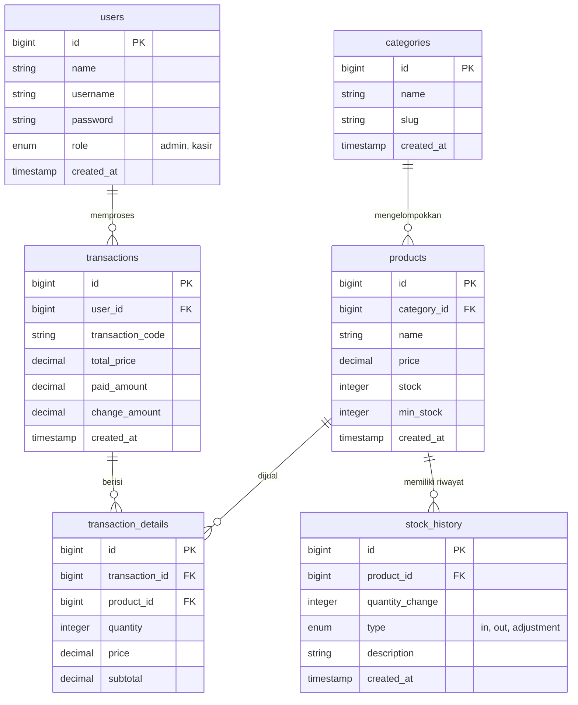

# inPOS - Sistem POS & Inventaris Bahan Baku

[](https://laravel.com)
[](https://php.net)
[](LICENSE)

**inPOS** adalah aplikasi Point of Sale (POS) dan Sistem Manajemen Inventaris Bahan Baku berbasis web yang modern, ringan, dan cepat. Aplikasi ini dirancang untuk membantu pemilik bisnis ritel atau F&B dalam mengelola transaksi penjualan kasir, memantau pergerakan stok barang, dan menganalisis performa bisnis melalui dashboard laporan yang interaktif.

---

## 🚀 Teknologi yang Digunakan

Aplikasi ini mengutamakan performa tinggi dan minimalisasi *bloatware* dengan menggunakan kombinasi teknologi berikut:

### 🖥️ Backend (Core)
*   **Laravel 10** — Framework PHP modern dengan arsitektur MVC yang solid.
*   **Laravel Sanctum** — Keamanan sesi login (Session-based) & perlindungan API.
*   **PHP 8.1+** — Versi PHP modern dengan fitur type hinting dan performa cepat.
*   **Laravel Tinker** — Interactive CLI shell untuk debugging dan testing internal.

### 💾 Database (Penyimpanan)
*   **MySQL / MariaDB** — Penyimpanan data relasional yang andal untuk transaksi dan riwayat stok.

### 🎨 Frontend (Interface)
*   **HTML5 & Laravel Blade Templates** — Struktur halaman web yang dinamis.
*   **Vanilla CSS (Custom stylesheet)** — Desain UI premium, responsif, modern, dan super ringan tanpa beban library pihak ketiga.
*   **Vanilla JavaScript (AJAX & Fetch API)** — Interaksi halaman yang mulus dan dinamis tanpa perlu *page reload* (SPA-like experience).

### 🛠️ Development Tools
*   **Laravel Sail** — Integrasi Docker untuk lingkungan pengembangan yang konsisten.
*   **Laravel Pint** — Standardisasi format kode agar tetap bersih dan rapi.
*   **PHPUnit / Pest** — Kerangka pengujian kode (Testing framework).

---

## 🌟 Fitur Utama

Aplikasi ini dibagi menjadi beberapa modul utama yang dapat diakses berdasarkan hak akses pengguna (**Admin** & **Kasir**):

### 1. 🔑 Sistem Autentikasi & Otorisasi
*   Login & Logout aman dengan proteksi CSRF.
*   **Role-Based Access Control (RBAC)**: memisahkan fitur kasir standar dengan fitur kontrol admin.

### 2. 📊 Dashboard Interaktif
*   Menampilkan ringkasan statistik bisnis seperti **Total Pendapatan**, **Jumlah Transaksi**, **Produk Terjual**, dan **Peringatan Stok Menipis**.
*   Grafik penjualan harian untuk melihat tren performa bisnis.

### 3. 🛍️ Point of Sale (POS) / Kasir
*   Antarmuka kasir yang interaktif dan responsif.
*   Pencarian produk dan filter berdasarkan kategori secara instan.
*   Keranjang belanja dinamis (tambah, kurangi, dan hapus item secara cepat).
*   Kalkulator kembalian otomatis.
*   Pencetakan struk belanja virtual setelah transaksi berhasil diproses.

### 4. 📦 Manajemen Produk & Kategori
*   Pengelolaan katalog produk yang dijual (Nama, Kategori, Harga, Minimum Stok, dan Jumlah Stok).
*   Pengelompokan produk berdasarkan kategori.
*   Pencarian dan penyaringan produk berbasis AJAX.

### 5. 📉 Manajemen Inventaris (Khusus Admin)
*   **Restocking**: Penambahan stok barang secara cepat saat pasokan baru tiba.
*   **Stock Adjustment**: Penyesuaian jumlah stok untuk mencatat barang rusak, hilang, atau kedaluwarsa.
*   **Stock Alerts**: Peringatan visual otomatis apabila stok produk berada di bawah limit minimum.
*   **Stock History**: Log riwayat mutasi stok lengkap untuk melacak kapan dan mengapa stok berubah.

### 6. 📈 Laporan & Analisis Bisnis (Khusus Admin)
*   Laporan total penjualan harian dan bulanan.
*   Laporan mutasi stok bahan baku.
*   Analisis produk terlaris (*Top Selling Products*).

---

## 🗄️ Struktur Database

Skema database terdiri dari tabel-tabel utama berikut:



---

## 🛠️ Langkah Instalasi & Cara Menjalankan

### Persyaratan Sistem
*   PHP `>= 8.1`
*   Composer
*   MySQL / MariaDB
*   Web server lokal (seperti Apache lewat XAMPP, Laragon, dll)

### Langkah-langkah Setup

1.  **Clone Repositori**
    ```bash
    git clone https://github.com/mhmdrifqi2005/inPOS.git
    cd inPOS
    ```

2.  **Instal Dependensi PHP**
    ```bash
    composer install
    ```

3.  **Salin File Konfigurasi Environment**
    ```bash
    copy .env.example .env
    ```
    *Sesuaikan koneksi database MySQL Anda di dalam file `.env` (misalnya `DB_DATABASE=inpos_laravel`, `DB_USERNAME=root`, `DB_PASSWORD=`).*

4.  **Generate Application Key**
    ```bash
    php artisan key:generate
    ```

5.  **Jalankan Migrasi & Isi Data Awal (Seeding)**
    ```bash
    php artisan migrate --seed
    ```
    *Perintah ini akan membuat semua tabel yang dibutuhkan beserta pengguna dummy default (admin & kasir) dan data produk awal.*

6.  **Jalankan Server Lokal**
    ```bash
    php artisan serve
    ```
    Buka browser Anda dan akses **`http://127.0.0.1:8000`**.

---

## 👥 Akun Akses Default (Seed)

Setelah Anda menjalankan seeder, Anda dapat login menggunakan akun berikut untuk pengujian:

*   **Akun Administrator**:
    *   Username: `admin`
    *   Password: `password`
*   **Akun Kasir**:
    *   Username: `kasir`
    *   Password: `password`
